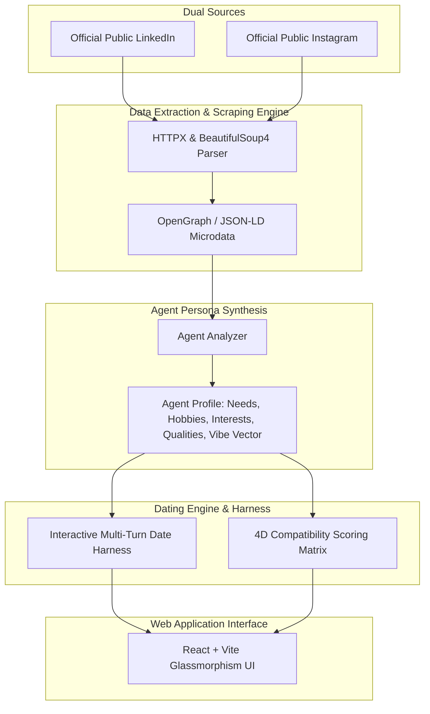

# Aura System Architecture

Aura is designed as an agentic dating platform where individuals are represented by autonomous AI agents. The system reads strictly two official public sources (**LinkedIn** and **Instagram**) for each person to construct their profile analysis, run interactive dating simulations, and generate compatibility rankings.

---

## Key Subsystems

### 1. Dual-Source Scraping Engine (`backend/scraper.py`)
- **LinkedIn Extraction**: Reads professional career trajectory, skills, leadership roles, education, and strategic values.
- **Instagram Extraction**: Reads lifestyle interests, hobbies, visual aesthetic, sports, social energy, and personal passions.
- **Fallback Extraction**: OpenGraph meta tags (`og:title`, `og:description`, `og:image`), Twitter cards, and Schema.org JSON-LD microdata.

### 2. Persona & Vibe Synthesis
- Formulates a 5-vector vibe score for every individual:
  1. **Ambition**: Career drive and long-term vision.
  2. **Social Energy**: Extroversion and warmth.
  3. **Intellectual Depth**: Analytical and philosophical orientation.
  4. **Emotional Openness**: Vulnerability and EQ.
  5. **Adventurousness**: Spontaneity and outdoor/sports drive.

### 3. Agentic Dating Harness (`backend/dating_harness.py`)
- Simulates realistic multi-turn dates between two autonomous agents.
- Evaluates conversation turns:
  - *Turn 1*: Warm introduction & venue setup.
  - *Turn 2*: Exploring career values & professional philosophy (LinkedIn).
  - *Turn 3*: Exchanging hobbies, passions & weekend routines (Instagram).
  - *Turn 4*: Testing emotional needs & partner expectations.
  - *Turn 5*: Wrap-up & date debrief reports.

### 4. 4D Compatibility Matrix (`backend/ranking.py`)
Calculates pairwise chemistry across 4 dimensions:
- $\text{Score} = (0.25 \times \text{Ambition}) + (0.25 \times \text{Hobbies}) + (0.25 \times \text{EQ}) + (0.25 \times \text{Intellect})$
