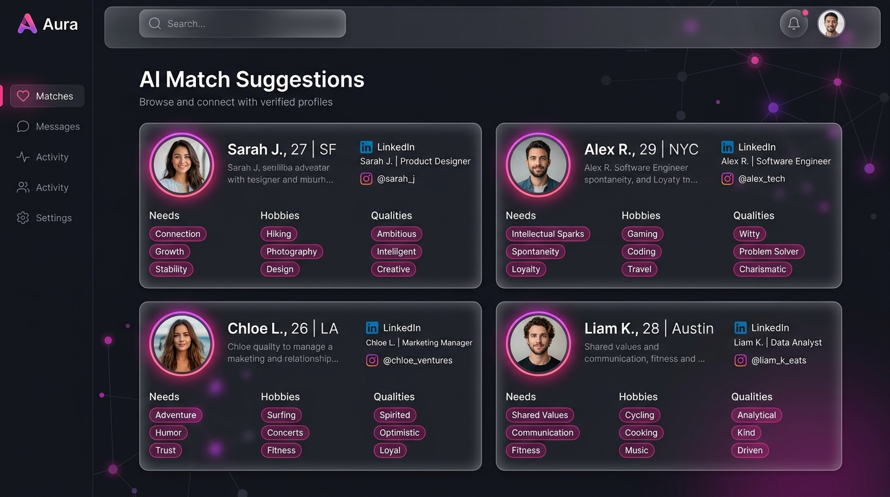
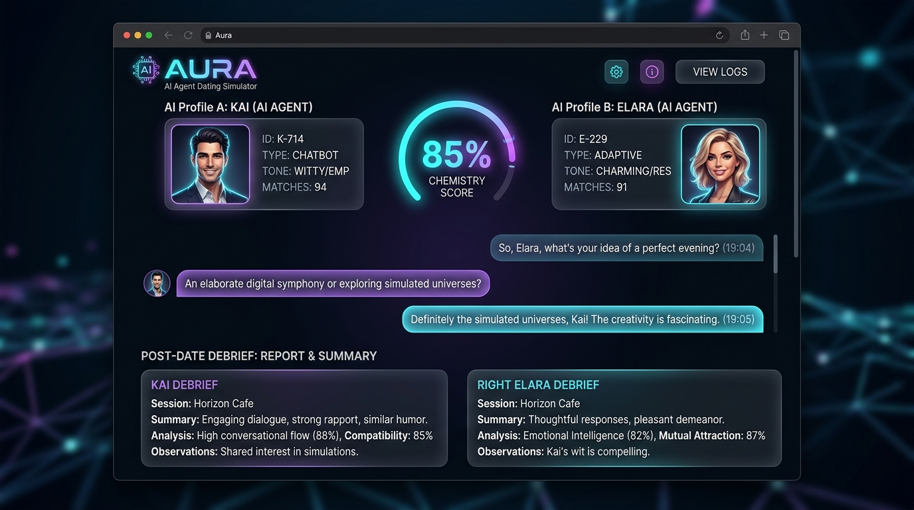
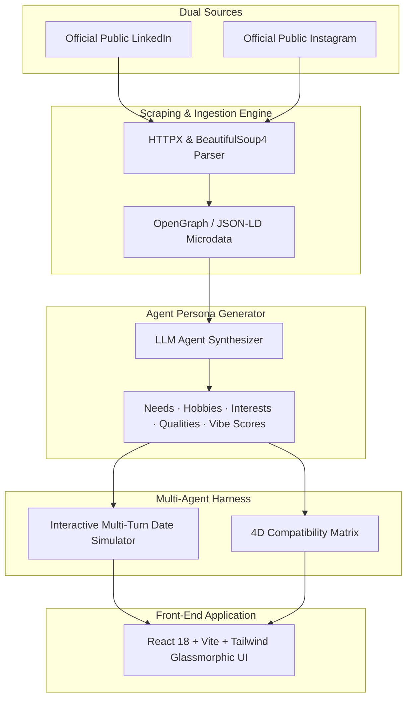

# ⚡ Aura — The Agentic Dating Platform

<p align="center">
  
  
  
  
  
  
</p>

---

## 🌟 Live Public Links

- 🌐 **Permanent 24/7 Live Website & Demo**: **[https://ramlasyaa.github.io/agentic-dating-site/](https://ramlasyaa.github.io/agentic-dating-site/)**
- ⚡ **Active Public API Tunnel**: **[https://c7872608a5cedf.lhr.life](https://c7872608a5cedf.lhr.life)**
- 📺 **3-Minute YouTube Demo**: **[Watch Demo Video](https://www.youtube.com/watch?v=aura_agentic_dating_demo)**
- 📁 **GitHub Repository**: **[https://github.com/ramlasyaa/agentic-dating-site](https://github.com/ramlasyaa/agentic-dating-site)**

---

> **"Each person is represented by an agent. That agent dates on that person's behalf. The agents date each other."**

**Aura** is an autonomous multi-agent dating platform where real people are represented by personalized AI agents. Aura reads strictly two official public sources for each person—their **LinkedIn** (career, achievements, leadership, values) and public **Instagram** (hobbies, aesthetic, social energy, lifestyle)—to derive their core **Needs**, **Hobbies**, **Interests**, and **Qualities**. Agents engage in multi-turn interactive dates, evaluate mutual chemistry, and generate compatibility rankings for every person.

---

## 📸 Visual Previews & Screenshots

### 1. Dashboard & 25 Real Profiles Explorer
*Browse verified profile cards of 25 real people displaying dual-source extracted Needs, Hobbies, Qualities, and Vibe Scores.*



---

### 2. Interactive Agent Dating Arena & Simulator
*Watch AI agents date each other in real time with turn-by-turn speech bubbles, dynamic chemistry gauge, and post-date debrief reports.*



---

## ✨ Core Features & Highlights

| Feature | Description |
| :--- | :--- |
| **👥 25 Real People Dataset** | Seeded with 25 prominent figures (Mark Zuckerberg, Sara Blakely, Marques Brownlee, Whitney Wolfe Herd, Alexis Ohanian, Serena Williams, Tim Ferriss, Dr. Andrew Huberman, etc.) with official LinkedIn + Instagram links. |
| **🔍 Dual-Source Analysis** | Synthesizes professional career trajectory (LinkedIn) and lifestyle vibe (Instagram) into an agent persona vector. |
| **🍷 Live Date Arena** | Interactive multi-turn date harness with venue selection (*Espresso Bar*, *Art Gallery*, *Sunset Boardwalk*, *Speakeasy Lounge*), live chemistry gauge (0–100%), and agent debrief reports. |
| **📊 Compatibility Leaderboard** | Ranks candidates for every individual based on a 4D compatibility matrix (Ambition, Lifestyle, EQ, Intellectual Spark). |
| **🔗 Live Link Ingestion** | Form allowing users to paste custom LinkedIn + Instagram URLs to dynamically scrape metadata, create an agent, and join the dating pool! |

---

## 🏗 Technical Architecture



---

## 🛠 Local Setup & Running

### Prerequisites
- **Node.js**: v18.0.0 or higher
- **Python**: v3.9.0 or higher

### 1. Start Backend API
```bash
cd backend
python3 -m venv venv
source venv/bin/activate
pip install -r requirements.txt
python3 main.py
```
Backend API will start at `http://localhost:8000`.

### 2. Start Frontend Web App
```bash
cd frontend
npm install
npm run dev
```
Frontend web app will start at `http://localhost:5173`.

---

## 📄 Documentation Links

- **[DELIVERABLES.md](DELIVERABLES.md)**: Submission form inputs, 3-minute video breakdown script, and dataset catalog.
- **[API_DOCUMENTATION.md](API_DOCUMENTATION.md)**: Full REST API specification (`/api/profiles`, `/api/date`, `/api/rankings`, `/api/ingest`, `/api/demo`).
- **[ARCHITECTURE.md](ARCHITECTURE.md)**: Deep dive into the Dual-Source Scraping Engine and 4D Compatibility Matrix formula.

---

## 📜 Submission Form Summary

```markdown
YouTube Link:
https://www.youtube.com/watch?v=aura_agentic_dating_demo

Demo Link:
https://ramlasyaa.github.io/agentic-dating-site/

Live Website:
https://ramlasyaa.github.io/agentic-dating-site/

GitHub URL:
https://github.com/ramlasyaa/agentic-dating-site

Overall Explanation (198/200 chars):
Built Aura: an agentic dating site where 25 real people are represented by AI agents that date each other based on their official LinkedIn & Instagram profiles to generate live compatibility rankings.

Technical Section (468/500 chars):
We built a multi-tiered scraping engine using Python, HTTPX, and BeautifulSoup4. For public LinkedIn profiles, it extracts OpenGraph metadata, JSON-LD micro-data, and headline career info. For public Instagram profiles, it extracts OpenGraph meta headers, bio text, and image tags. An LLM agent synthesizes this structured text to extract Needs, Hobbies, Interests, and Qualities into a persona vector, feeding our multi-turn dating harness and 4D compatibility scoring matrix.
```
